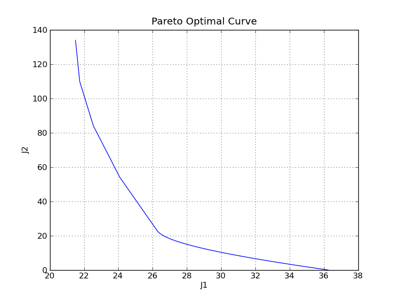

.. _program:

********
Programs
********
Optimization programs (or problems) are constructed by using the interface function :func:`program()<cvxpy.interface.program>`. In the simplest case, this function takes as arguments an action and a list of constraints, and returns a :ref:`program object<program_obj>`. The action is constructed by using the interface function :func:`minimize()<cvxpy.interface.minimize>` or :func:`maximize()<cvxpy.interface.maximize>`, both of which take as argument the objective function of the program to be constructed. The following example shows how to construct a program::

   >>> a = matrix([[1,2,3],[4,5,6],[7,8,9]])	       	        
   >>> A = a.T*a						# Create a symmetric matrix
   
   >>> x = variable()						# Create an optimization variable

   >>> p = program(minimize(x),					  
   ...             [belongs(x*eye(3)-A,semidefinite_cone)])	# Create a program

Once a program is constructed, we can solve it by calling its ``solve()`` method::

   >>> p.solve()

   Calling CVXOPT ...
   	pcost       dcost       gap    pres   dres   k/t
    0:  9.5000e+01  9.5000e+01  2e+02  1e+00  3e-16  1e+00
    1:  2.6868e+02  2.8196e+02  5e+01  5e-01  9e-16  1e+01
    2:  2.8366e+02  2.8380e+02  5e-01  5e-03  1e-16  1e-01
    3:  2.8386e+02  2.8386e+02  5e-03  5e-05  1e-16  1e-03
    4:  2.8386e+02  2.8386e+02  5e-05  5e-07  5e-16  1e-05
   Optimal solution found.
   283.86

To suppress the output, we can pass the ``solve()`` method a boolean argument::

   >>> p.solve(quiet=True)    	 	  	    	# Enable quiet mode
   283.86

After solving the program, the values of the optimization variables are set with the point found by the algorithm::

   >>> x.value
   283.86

.. note:: CVXPY will only attempt to solve a program when the program satisfies the rules of Disciplined Convex Programming. If a program is not DCP-compliant, its ``solve()`` method will raise an exception.

Once a program is constructed, it is also possible to extract its objective function, constraints, variables and parameters. This is done by accessing the program's ``objective``, ``constraints``, ``variables`` and ``parameters`` fields. The following example illustrates these features::

   >>> c = parameter(4,1,name='c') 	    	      	         	# Create a parameter and set its value
   >>> c.value = matrix([1,-1,1,-1]).T

   >>> x = variable(4,1,name='x')					# Create an optimization variable

   >>> p = program(minimize(c.T*x),[leq(abs(x),2)])			# Construct a program
     
   >>> print p.objective						# Get the program's objective function
   c[0,0]*x[0,0] + c[1,0]*x[1,0] + c[2,0]*x[2,0] + c[3,0]*x[3,0]

   >>> print p.constraints						# Get the program's constraints
   abs(x[0,0]) <= 2
   abs(x[1,0]) <= 2
   abs(x[2,0]) <= 2
   abs(x[3,0]) <= 2

   >>> print p.variables						# Get the program's variables
   x[0,0]
   x[1,0]
   x[3,0]
   x[2,0]

   >>> print p.parameters						# Get the program's parameters
   c[0,0]
   c[2,0]
   c[3,0]
   c[1,0]

Finally, it is also possible to obtain a description of the program by calling its ``show()`` method. This method exists mainly for debugging purposes since for problems with many variables and constraints, the output can look very ugly::
   
   >>> p.show()

   minimize c[0,0]*x[0,0] + c[1,0]*x[1,0] + c[2,0]*x[2,0] + c[3,0]*x[3,0]
   subject to
   abs(x[0,0]) <= 2 
   abs(x[1,0]) <= 2
   abs(x[2,0]) <= 2
   abs(x[3,0]) <= 2

.. _family_programs:	      

Families of programs
====================
As mentioned earlier, parameters can be used for creating families of optimization programs. Indeed, this can be done by constructing a single program that includes parameters. When we try to solve such program, CVXPY first creates a new program using the values of the parameters and then solves it. Hence, different elements of the family can be obtained by assigning different values to the parameters. The following example uses this technique to create a family of regularized least squares problems, for which a parameter controls the trade off between fit error and model complexity. This example also selects a few different values for such parameter and computes the Pareto optimal curve::

   >>> from cvxpy import *	     	     	 	        # Load modules    
   >>> import numpy
   >>> import pylab

   >>> A = rand(5,2)						# Generate data	
   >>> b = 30*rand(5,1)

   >>> x = variable(2,1)					# Create an optimization variable and a parameter
   >>> lam = parameter(attribute='nonnegative')

   >>> J1 = norm2(A*x-b)					# Create objectives
   >>> J2 = norm1(x)

   >>> p = program(minimize(J1+lam*J2))				# Create family of programs (no constraints)

   >>> def f(J):						# Define helper function
   ...     def g(l):
   ...         lam.value = l					# Assign parameter value
   ...         p.solve(quiet=True)				# Solve element of family
   ...         return J.value
   ...     return g

   >>> l_vals = numpy.linspace(1e-8,1e0,50)			# Parameter values to be used 

   >>> pylab.plot(map(f(J1),l_vals),map(f(J2),l_vals))		# Compute and plot Pareto optimal curve
   >>> pylab.title("Pareto Optimal Curve")
   >>> pylab.xlabel("J1")				
   >>> pylab.ylabel("J2")
   >>> pylab.grid()				
   >>> pylab.show()
 

.. _functions_programs:

Programs as functions
=====================	
In CVXPY, optimization programs are in fact functions. The syntax for calling a program is specified at construction by passing to the function :func:`program()<cvxpy.interface.program>` an additional list of ``formals``. This list of formals consists of the variables and parameters that are to be replaced by the arguments in a program call. When a program is called with arguments, these arguments replace the formals in the body of the program, producing a new program. This new program is then solved and the objective value is returned. If the list of formals is not specified at construction, it is set to the empty list so the resulting program is a function of zero arguments. The next example illustrates this feature::

   >>> x = variable()	    	 	      	       	      	     # Create variables
   >>> y = variable()	

   >>> a = parameter()						     # Create a parameter and set its value
   >>> a.value = 10

   >>> p = program(minimize(a*x+y),[leq(abs(x),1),geq(y,0)])	     # List of formals is [] by default so p takes  
   >>> p()							     # zero arguments.
   -10.0000

   >>> p = program(minimize(a*x+y),[leq(abs(x),1),geq(y,0)],[a])     # List of formals is [a] so p takes one argument.
   >>> 	 							     # Call p with 20. 20 replaces a in the body of p 
   >>> p(20)							     # and the new program is solved.
   -20.0000 

   >>> p = program(minimize(a*x+y),[leq(abs(x),1),geq(y,0)],[a,y])   # List of formals is [a,y] so p takes two arguments.	
   >>> 	        						     # Call p with 20,30. 20 replaces a, 30 replaces y 
   >>> p(20,30)							     # and the new program is solved.
   10.0000

Formals can also be multidimensional variables and multidimensional parameters::

   >>> w = variable(3,1)					# Create variables and a parameter
   >>> z = variable(3,1)						
   >>> c = parameter(3,1)

   >>> p = program(minimize(c.T*w),[geq(w,z)],[z,c])		# List of formals is [z,c] so p takes two arguments. 
   >>>								# -ones((3,1)) replaces z, matrix([1,2,3]).T replaces c 
   >>> p(-ones((3,1)),matrix([1,2,3]).T)			# and the new program is solved.
   -6.00000
